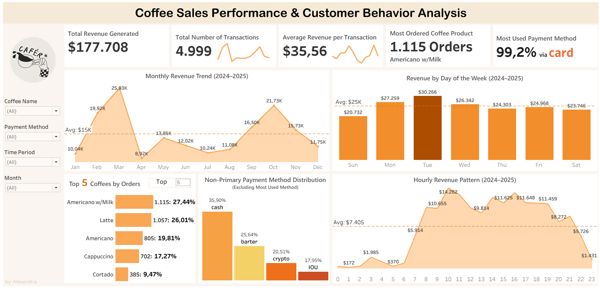

# ☕ Coffee Sales Performance & Customer Behavior Analysis

> An interactive Tableau dashboard that transforms transactional coffee sales data into actionable business insights through revenue, product, customer behavior, and time-based analysis.



---

## 📌 Project Overview

**Coffee Sales Performance & Customer Behavior Analysis** is a data analytics project focused on understanding sales performance and customer purchasing behavior in a coffee shop.

The project goes beyond simply reporting sales numbers. It explores **revenue trends, transaction value, product performance, payment behavior, and purchasing patterns across different days and hours** to identify meaningful business insights.

The analysis was developed around several key business questions and translated into an interactive Tableau dashboard to make the findings easier to explore and communicate.

---

## 🎯 Business Questions

The analysis focuses on five key business questions:

### 01. Is revenue performance stable?

Is the business generating consistent revenue, or does revenue fluctuate significantly across different periods?

### 02. When are the most profitable time periods?

Which days and hours generate revenue above the overall average?

### 03. Which products truly drive revenue?

Does the most frequently purchased product also generate the highest revenue?

### 04. Are payment methods aligned with customer behavior?

How do customers distribute their transactions across different payment methods?

### 05. Is transaction value already optimized?

Are customers maintaining a strong average transaction value, or is there an opportunity to increase spending per transaction?

---

# 📊 Dashboard

The interactive dashboard provides an overview of coffee sales performance through several analytical perspectives.

### Key Performance Indicators

| KPI | Result |
|---|---:|
| 💰 Total Revenue | **$177,708** |
| 🧾 Total Transactions | **4,999** |
| 💵 Average Revenue per Transaction | **$35.56** |
| ☕ Most Ordered Product | **Americano w/Milk** |
| 💳 Most Used Payment Method | **Card — 99.2%** |

### Dashboard Components

The dashboard includes:

- **Monthly Revenue Trend** — tracks revenue performance across months
- **Revenue by Day of Week** — identifies stronger and weaker sales days
- **Hourly Revenue Pattern** — identifies peak and low-performing hours
- **Top 5 Coffees by Orders** — highlights the most frequently ordered products
- **Payment Method Distribution** — examines customer payment behavior
- **Interactive Filters** — allows users to explore the data by coffee name, payment method, time period, and month

---

# 🔍 Key Insights

## 1. Revenue ≠ Transaction Volume

Revenue performance is not always driven by the number of transactions.

In some periods, higher revenue is associated with a **higher average transaction value**, rather than simply an increase in transaction volume.

### 💡 Business Implication

The business can explore strategies to increase the value of individual transactions, such as:

- Upselling complementary products
- Menu bundling
- Add-on promotions
- Encouraging higher-value purchases

> **Key takeaway:** Increasing transaction value can be an important opportunity for improving revenue without relying solely on increasing transaction volume.

---

## 2. Revenue Is Concentrated in Specific Time Periods

Revenue is not distributed evenly throughout the day and across the week.

Several hours and days generate revenue above the overall average, indicating periods of stronger customer activity.

### 💡 Business Implication

Peak and low-performing periods can support decisions related to:

- Staff scheduling
- Inventory planning
- Operational resource allocation
- Promotion timing
- Cost efficiency during weaker periods

> **Key takeaway:** Understanding *when* revenue occurs can be as important as understanding *how much* revenue is generated.

---

## 3. Popular Product ≠ Profitable Product

The product with the highest purchase volume is not necessarily the product generating the highest revenue.

For example, based on the analysis for **March 1, 2024**:

| Product | Revenue |
|---|---:|
| Americano with Milk | $33.8 |
| Latte | $38.7 |

Although Americano with Milk is one of the most frequently purchased products, Latte generated a higher revenue value in the example analyzed.

### 💡 Business Implication

Product performance should therefore be evaluated using more than purchase volume.

A combination of:

**Purchase Volume + Revenue Contribution**

can provide a more complete view of product performance.

Products with stronger revenue contribution can be prioritized in promotional strategies, while high-volume products with lower revenue contribution can be evaluated from a pricing or cost perspective.

> **Key takeaway:** A popular product is not automatically the most valuable product from a revenue perspective.

---

## 4. Customer Payment Behavior Is Diverse

The analysis shows that customers do not rely exclusively on a single payment method.

Although one payment method dominates the overall transactions, alternative payment methods are still used by customers.

### 💡 Business Implication

Alternative payment methods can remain available to:

- Maintain customer convenience
- Support different customer segments
- Reduce excessive dependency on a single payment method

> **Key takeaway:** Payment behavior can provide additional context for understanding customer preferences and transaction patterns.

---

## 5. Average Transaction Value Declines Over Time

The analysis identified a decrease in average transaction value between **May and August**, even though transactions continued to occur during the period.

This suggests that transaction volume alone does not necessarily reflect changes in customer spending behavior.

### 💡 Business Implication

Potential strategies to increase transaction value include:

- Menu bundling
- Add-on promotions
- Cross-selling
- Targeted offers
- Pricing adjustments for selected products

> **Key takeaway:** Maintaining transaction volume is not enough if customers are spending less per transaction.

---

# 🧠 Analytical Approach

The project follows a business-oriented data analysis workflow:

```text
Raw Transactional Data
        ↓
Data Preparation
        ↓
Exploratory Analysis
        ↓
Business Questions
        ↓
Dashboard Development
        ↓
Pattern & Trend Identification
        ↓
Business Insights
        ↓
Business Recommendations
